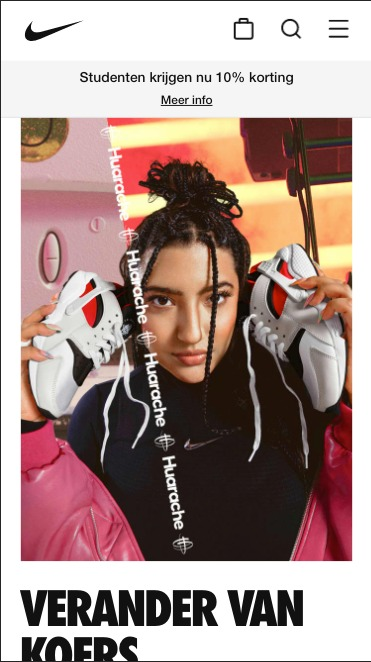
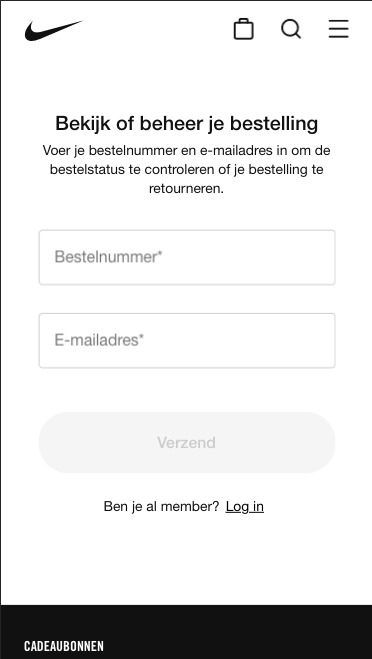
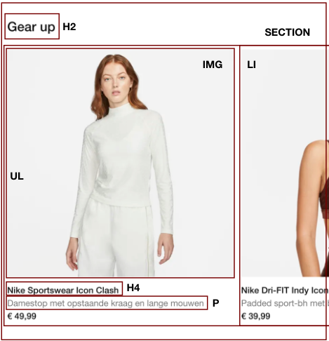
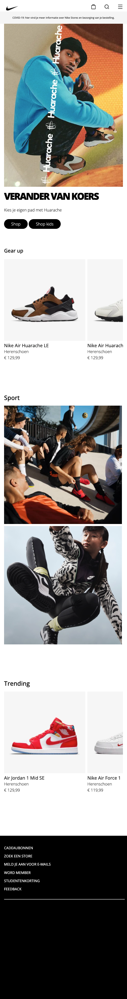
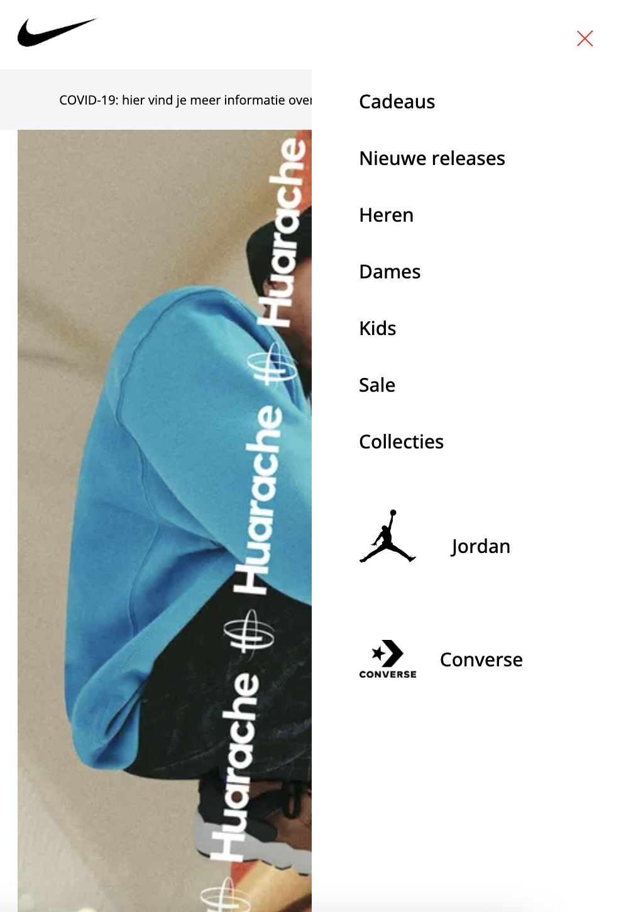
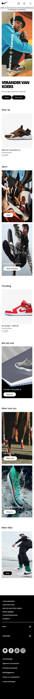
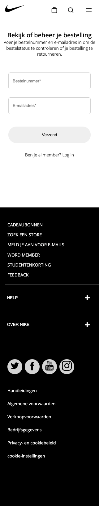
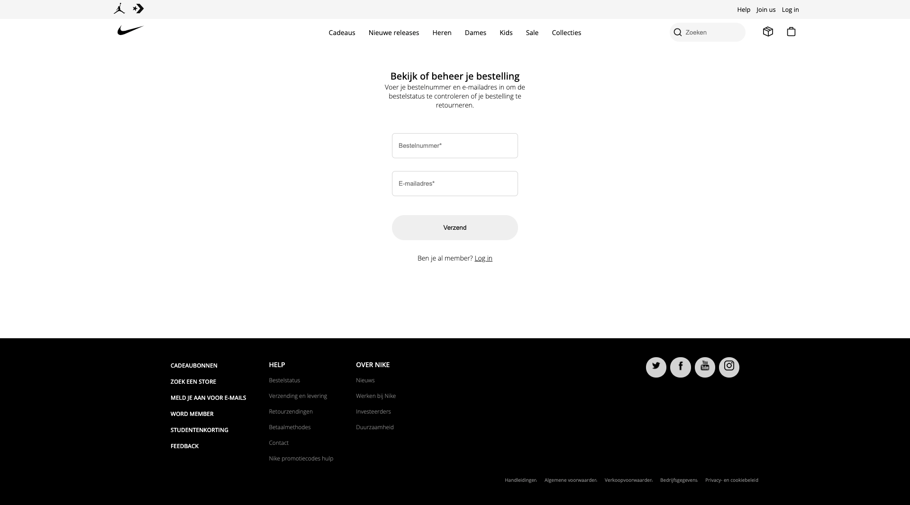

# Procesverslag
Markdown is een simpele manier om HTML te schrijven.  
Markdown cheat cheet: [Hulp bij het schrijven van Markdown](https://github.com/adam-p/markdown-here/wiki/Markdown-Cheatsheet).

Nb. De standaardstructuur en de spartaanse opmaak van de README.md zijn helemaal prima. Het gaat om de inhoud van je procesverslag. Besteedt de tijd voor pracht en praal aan je website.

Nb. Door *open* toe te voegen aan een *details* element kun je deze standaard open zetten. Fijn om dat steeds voor de relevante stuk(ken) te doen.

## Jij

uitwerken voor kick-off werkgroep

### Auteur:
Kevin Speek
 
 
#### Je startniveau:
Ik denk zelf dat ik op de rode piste zit, omdat ik code ook weer niet onwijs lastig vind (de basis dan). Het is ook niet zo dat ik er onwijs goed in ben, maar als eenmaal bepaalde dingen lukken dan is het natuurlijk tof. 
 
 
#### Je focus:
Ik ga mezelf focussen op zowel responsive als de surface. Ik wil dat mijn website sowieso bruikbaar is op een telefoon en laptop. 

## Je website

uitwerken voor kick-off werkgroep

### Je opdracht:
https://www.nike.com/nl/

#### Screenshot(s) van de eerste pagina (small screen): 
hier de naam van de pagina  
Homepagina Nike 

#### Screenshot(s) van de tweede pagina (small screen):
hier de naam van de pagina  
Bestelpagina Nike

## Breakdownschets (week 1)

uitwerken na afloop 2e werkgroep

### de hele pagina: 

### dynamisch deel (bijv menu): 

## Voortgang 1 (week 2)

uitwerken voor 1e voortgang

### Stand van zaken

### Agenda voor meeting
samen met je groepje opstellen

| Kevin              | Xiao Nan           | student 3    | student 4        |
| ---                | ---                | ---          | ---              |
|Ik wil graag weten  | Aria Label
|hoe ik content      | Feedback HTML
|kan verwerken op    |
|de background-images|

### Verslag van meeting
hier na afloop snel de uitkomsten van de meeting vastleggen

- Dat kan door position te gebruiken. Position:relative op de parent en position:absolute op de child

## Voortgang 2 (week 3)

uitwerken voor 2e voortgang

### Stand van zaken
Het maken van het hamburger menu verliep goed. De website responsive maken is wel nog een hele klus en daar zou ik eigenlijk nog meer over moeten leren. 
 
 
 
 

### Agenda voor meeting
samen met je groepje opstellen

| Kevin                        | Xiao Nan           | student 3    | student 4        |
| ---                          | ---                | ---          | ---              |
| Graag meekijken              | slider boven	      |
| naar het responsive          | randje foto	       |
| maken van de website.        | js + aanspreken    |
|                              |
| sections schalen niet mee    |
| nieuwe afbeelding bij        |
| desktop breakpoint           |
|                              |
| Scroll over doet het niet.   |
 
 

### Verslag van meeting
hier na afloop snel de uitkomsten van de meeting vastleggen

- Er is aan mij uitgelegd hoe je van afbeelding kan verwisselen bij een breakpoint. Dit doe je met een background-image. Ik heb dit toegepast op mijn website.
- Voor het responsive maken van de website heb ik gekeken naar de opdrachten uit de lessen.

## Toegankelijkheidstest (week 4)

uitwerken na test in 8e voortgang

### Bevindingen
Lijst met je bevindingen die in de test naar voren kwamen:
 - Er kan overal gekomen wordem d.m.v. tab, maar als je tabt aan het begin van de website en je opent het hamburger menu niet, dan tabt hij door het hamburger menu    i.p.v. gelijk naar de content. 
 - Hamburger menu klapt niet automatisch dicht als je aan het einde van de hamburger menu door tabt. 
 
 - Blur is moeilijk zichtbaar.
 - Met de vlekken bril was de content goed te zien.
 - De website is goed te gebruiken voor iemand met concentratieproblemen 
 - De webiste is goed te gebruiken voor mensen met een slechte motoriek. Al weet ik niet precies wat de bedoeling was, omdat je met twee vingers de website moest besturen, maar gewoon nog altijd met één vinger door de website kon gaan. 
 - De website wordt goed gelezen door de screenreader
 
**#### Tab naar de content.**
Hier korte omschrijving (met indien nodig een afbeelding)

Dit probleem kan ik oplossen door een a-element te maken die je direct naar de content brengt.
 
 
 

**#### Hamburger klapt niet automatisch dicht aan het einde van het menu als je door tabt.** 
 
Het menu moet weten dat als er naar de content wordt door getabt, dat het automatisch moet sluiten. Hoe je dat kan regelen weet ik niet precies.

#### Blur is moeilijk leesbaar

Voor de problemen met blur is het denk ik goed om al het content heel erg te vergroten, zodat de gebruiker het beter kan zien.

#### Titel nog een bevinding. 
Hier korte omschrijving (met indien nodig een afbeelding)

Hier een omschrijving van hoe het opgelost kan worden (met indien nodig een afbeelding)

## Voortgang 3 (week 4)

uitwerken voor 3e voortgang

### Stand van zaken
hier dit ging goed & dit was lastig (neem ook screenshots op van delen van je website en code)

### Agenda voor meeting
samen met je groepje opstellen

| Kevin                      | Xiao Nan      | Bram    |
| ---                        | ---           | ---     |        
| De foto main foto          | JS            | @Media  |
 schaalde niet goed          | Foto          |         |
 mee en de tekst daaronder   |               |         | 
 ook niet                    |               |         |
| Overscroll-behavior        |               |         |
| ...                        | ...           | ...     |

### Verslag van meeting
hier na afloop snel de uitkomsten van de meeting vastleggen

- Het probleem met het meeschalen is opgelost tijdens de meeting
- De oversroll-behavior gaat Sanne nog voor mij uitzoeken

## Eindgesprek (week 5)

uitwerken voor eindgesprek

### Stand van zaken
Over het algemeen vind ik dat ik een mooie eindpresentatie heb neergezet. Ik heb zoveel mogelijk geprobeerd om het zelf allemaal uit te zoeken, maar bij bepaalde punten heb ik toch om hulp gevraagd. De lessen waren zeer informatief en hebben mij voor een groot deel geholpen om er een mooi eindresultaat van te maken. Door zelf te doen en te onderzoeken heb ik veel geleerd.

### Screenshot(s)

 
 
 
 

## Bronnenlijst

continu bijhouden terwijl je werkt

Nb. Wees specifiek ('css-tricks' als bron is bijv. niet specifiek genoeg).

1. https://codepen.io/shooft/pen/wvrMdja. // Link om direct naar de content te gaan.
2. https://codepen.io/grohit/pen/mdJqEzK  // Pagina na het verzenden van het formulier
3. https://css-irl.info/animating-underlines/ // Underline navigatie
4. https://fonts.google.com/specimen/DM+Sans // Google Fonts
5. 

